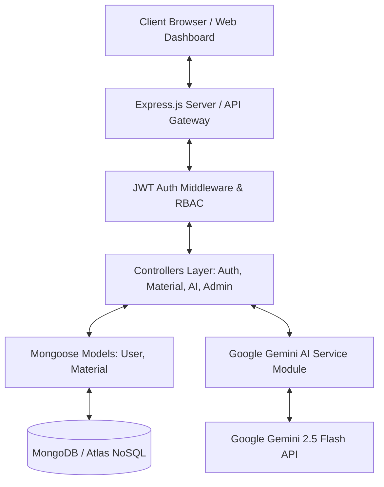
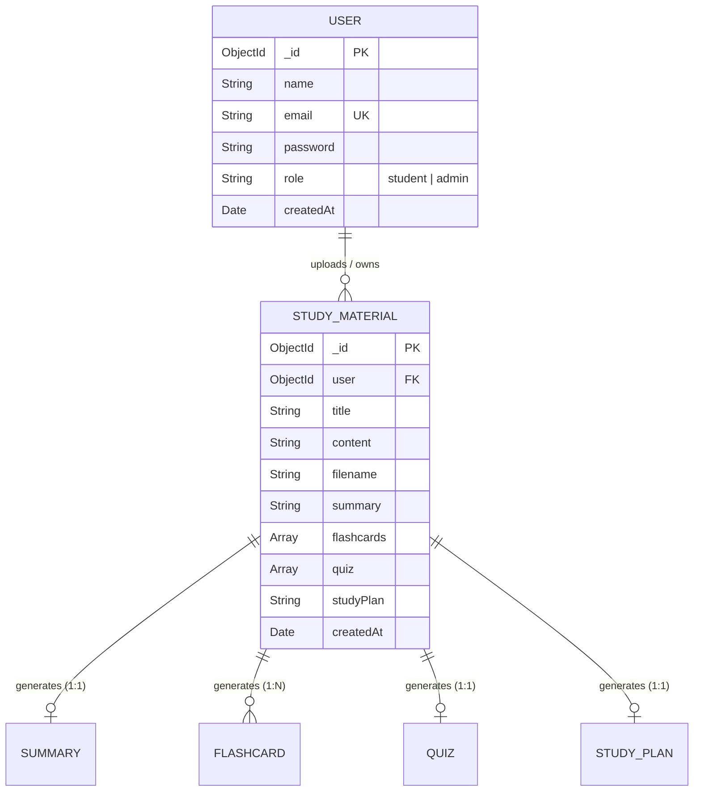

# LearnMate (AI StudyBuddy) - Comprehensive Project & Developer Guide

**LearnMate (AI StudyBuddy)** is an AI-powered learning assistance platform developed with Node.js, Express.js, MongoDB (Mongoose), JWT, Bcrypt, and the Google Gemini AI API. It automates note summarization, flashcard creation, multiple-choice quiz generation, and personalized study planning.

---

## 🏗️ Architecture & Component Overview

The application follows the **Model-View-Controller (MVC)** pattern for RESTful scalability and clean separation of concerns.



### MVC Layer Responsibilities
- **Model Layer (`src/models/`)**: Manages MongoDB data schemas, field validation rules, and password hashing (`User.js`, `Material.js`).
- **Controller Layer (`src/controllers/`)**: Encapsulates business logic, JWT authentication, authorization guards, material processing, and Gemini AI interactions.
- **View Layer (`public/`)**: Serves a sleek, dark-themed Glassmorphism Single-Page Application (SPA) frontend alongside RESTful JSON endpoints.
- **Service & Utility Layer (`src/utils/`)**: Includes database connection management (`db.js`), JWT signing (`tokens.js`), and Gemini AI prompt generation (`gemini.js`).

---

## 📊 Entity-Relationship (ER) Schema



---

## ⚡ Prerequisites & Requirements

- **Node.js**: v16.0.0 or higher (v18+ recommended)
- **npm**: v8.0.0 or higher
- **MongoDB**: Local MongoDB Server or MongoDB Atlas cluster connection string
- **Google Gemini API Key**: API key generated from [Google AI Studio](https://aistudio.google.com/)

---

## 🛠️ Installation & Setup Guide

### Step 1: Clone or Navigate to Project Directory
```bash
cd d:\learnmate
```

### Step 2: Install Package Dependencies
```bash
npm install
```

### Step 3: Configure Environment Variables
Create a `.env` file in the project root directory (refer to `.env.example`):

```env
PORT=5000
MONGO_URI=mongodb://127.0.0.1:27017/learnmate_db
JWT_ACCESS_SECRET=learnmate_jwt_access_secret_key_2026_super_secure
JWT_REFRESH_SECRET=learnmate_jwt_refresh_secret_key_2026_super_secure
GEMINI_API_KEY=your_gemini_api_key_here
```

> **Note:** If `GEMINI_API_KEY` is not supplied or during test execution, the application automatically uses built-in smart mock fallbacks.

---

## 🚀 Running the Application

### Development Mode (with Nodemon hot-reloading)
```bash
npm run dev
```

### Production Mode
```bash
npm start
```

Access the interactive web dashboard in your browser:
👉 **`http://localhost:5000`**

---

## 🧪 Running Automated Tests

Run the complete 16-point automated integration test suite:

```bash
npm test
```

### Test Suite Scope:
1. `GET /api/health` — Server health check
2. `POST /api/auth/register` — Student user registration & password encryption
3. `POST /api/auth/register` — Admin user registration
4. `POST /api/auth/login` — Authentication & JWT token issuance
5. `POST /api/auth/refresh` — Access token renewal via refresh token
6. `GET /api/auth/me` — Protected user profile retrieval
7. `POST /api/materials` — Direct text study material upload
8. `GET /api/materials` — Filtered study materials retrieval
9. `POST /api/materials/:id/summarize` — AI summary generation
10. `POST /api/materials/:id/flashcards` — Active recall flashcards generation
11. `POST /api/materials/:id/quiz` — Multiple-choice practice quiz generation
12. `POST /api/materials/:id/study-plan` — Personalized 7-day schedule creation
13. `POST /api/ai/flashcards` — Standalone direct AI feature endpoint
14. `GET /api/admin/stats` — RBAC security guard verification (Student forbidden)
15. `GET /api/admin/stats` — Admin platform analytics
16. `GET /api/admin/users` — Admin account management list

---

## 📡 REST API Endpoint Documentation

### 🔑 Authentication Endpoints (`/api/auth`)

#### 1. Register User
- **Method**: `POST`
- **URL**: `/api/auth/register`
- **Body**:
  ```json
  {
    "name": "Rahul Sharma",
    "email": "rahul@university.edu",
    "password": "securepassword123",
    "role": "student"
  }
  ```
- **Response** (`201 Created`):
  ```json
  {
    "message": "Registered successfully",
    "accessToken": "eyJhbGciOi...",
    "refreshToken": "eyJhbGciOi...",
    "user": { "id": "...", "name": "Rahul Sharma", "email": "rahul@university.edu", "role": "student" }
  }
  ```

#### 2. Login User
- **Method**: `POST`
- **URL**: `/api/auth/login`
- **Body**:
  ```json
  {
    "email": "rahul@university.edu",
    "password": "securepassword123"
  }
  ```

#### 3. Refresh Access Token
- **Method**: `POST`
- **URL**: `/api/auth/refresh`
- **Headers**: `x-refresh-token: <REFRESH_TOKEN>`

---

### 📚 Study Materials Endpoints (`/api/materials`)

#### 1. Create / Upload Material (Multipart File or Direct Text)
- **Method**: `POST`
- **URL**: `/api/materials/upload` or `/api/materials`
- **Headers**: `Authorization: Bearer <ACCESS_TOKEN>`
- **Body (Text)**:
  ```json
  {
    "title": "Operating Systems - Process Management",
    "content": "A process is a program in execution requiring CPU time, memory, and I/O resources..."
  }
  ```
- **Body (Multipart File)**: `file` field (`.txt`, `.md`, `.pdf`).

#### 2. List User Materials
- **Method**: `GET`
- **URL**: `/api/materials`
- **Headers**: `Authorization: Bearer <ACCESS_TOKEN>`

---

### 🤖 AI Generation Endpoints

#### 1. Generate Material Summary
- **Method**: `POST`
- **URL**: `/api/materials/:id/summarize`
- **Headers**: `Authorization: Bearer <ACCESS_TOKEN>`

#### 2. Generate Flashcards Deck
- **Method**: `POST`
- **URL**: `/api/materials/:id/flashcards`
- **Headers**: `Authorization: Bearer <ACCESS_TOKEN>`
- **Body**: `{ "count": 5 }`

#### 3. Generate Multiple Choice Quiz
- **Method**: `POST`
- **URL**: `/api/materials/:id/quiz`
- **Headers**: `Authorization: Bearer <ACCESS_TOKEN>`
- **Body**: `{ "count": 5 }`

#### 4. Generate Study Plan
- **Method**: `POST`
- **URL**: `/api/materials/:id/study-plan`
- **Headers**: `Authorization: Bearer <ACCESS_TOKEN>`
- **Body**: `{ "goal": "Master OS Concepts", "days": 7 }`

---

### 🛡️ Administrative Endpoints (`/api/admin`)

#### 1. Platform Metrics
- **Method**: `GET`
- **URL**: `/api/admin/stats`
- **Headers**: `Authorization: Bearer <ADMIN_ACCESS_TOKEN>`

#### 2. Manage Users List
- **Method**: `GET`
- **URL**: `/api/admin/users`
- **Headers**: `Authorization: Bearer <ADMIN_ACCESS_TOKEN>`

#### 3. Delete Student Account & Cascade Clean
- **Method**: `DELETE`
- **URL**: `/api/admin/users/:id`
- **Headers**: `Authorization: Bearer <ADMIN_ACCESS_TOKEN>`

---

## 🏆 Project Structure

```
d:\learnmate
├── .env                  # Environment variables
├── .env.example          # Environment template
├── .gitignore            # Git ignore file
├── index.js              # Express server application entry point
├── package.json          # Node dependencies and npm scripts
├── PROJECT_GUIDE.md      # Comprehensive documentation
├── public/               # Web Application Dashboard Frontend
│   ├── app.js            # Client SPA logic & API integrations
│   ├── index.html        # HTML structure & components
│   └── style.css         # Glassmorphism dark design system
├── src/
│   ├── controllers/      # Route controllers (Auth, Material, Admin)
│   ├── middleware/       # JWT protection, RBAC, Multer upload
│   ├── models/           # Mongoose schemas (User, Material)
│   ├── routes/           # Express router endpoints
│   └── utils/            # DB connection, Gemini API, JWT tokens
├── tests/
│   └── run-tests.js      # Automated 16-step integration test runner
└── uploads/              # Uploaded document files directory
```
